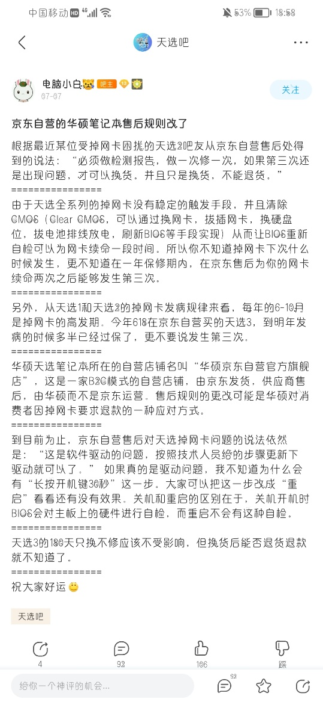

# 2022北京邮电大学数码社**笔记本电脑选购**交流

[TOC] 

## 一、 社团简介

我们的创办宗旨是：**让更多的人了解与我们北邮息息相关的数码世界**

我们会通过公众号推送，视频讲解等为大家普及数码知识

我们社团中不缺乏技术大佬，但是更重要的是我们对于技术的态度

**Come and Join us!**

## 二、 电脑分类

电脑可分为台式机和笔记本。台式机可以购买一体机也可自己购买配件组装，但比较专业，有此方面的需求可以咨询社内学长。台式机的缺点是体积较大，不能携带，但通过携带性和体积功耗的妥协得到了较高的性能。北邮沙河校区（新生）宿舍统一为上床下桌，在此校区的学生完全可以购买台式机。大三大四需要搬到本部的学生也可以选择搬家时通过北邮二手平台出售。但是据观察，由于自习和上课的需要，在沙河校区的同学绝大多数还是选择了笔记本而不是台式机，故本文暂不涉及台式机的选购。考虑到现阶段的台式机DIY市场疫情移动办公的需要，在不是必须的情况下笔者并不太推荐组装台式机。

笔记本电脑根据操作系统可分为 Windows 笔记本和 MacBook 系列笔记本。值得一提的是，MacBook 所使用的 macOS 是基于 Unix 搭建的，在操作上与 Linux 系统更为相近，且快捷键有差距较大，对于只用过 Windows 系统的同学们来说可能会有一定的上手难度。更重要的是，近年来 Apple 公司全面将 MacBook 系列替换成 M 系列的芯片（ARM 架构），这与常见的 Windows 笔记本所搭载的 Intel 或 AMD 芯片（x86 架构）有天壤之别；因此在泛用性（如开发环境和老旧软件等）上笔者更推荐搭载 x86 架构芯片的笔记本。虽说 MacBook 可以通过双系统等解决方案来运行 Windows，但不建议普通用户和小白如此操作，习惯上还是将 MacBook 和其他阵营的笔记本分开讨论。

根据性能/用途来分，可分为轻薄本、全能本、游戏本。

首先是**轻薄本**（预计花费 3500\~6000，甚至更低），若你的电脑只是用来类似简单的编程、办公、看剧等的轻度使用，便携、续航能力强的轻薄本是良好的选择（轻薄本太好看啦），小新 Air14 / Air14 plus、惠普战 X 等型号都是良好的选择，轻薄本的讲究不是很多，笔者认为有一块良好的屏幕就够了（当然是对于现在主流的轻薄本来说）。

**MacBook 属于轻薄本（当然价格并不属于这个阶段）**

其次是**全能本**（预计花费 5000\~7000），你可以理解成轻薄本与游戏本之间的妥协版本。对于现阶段比较大众且对配置要求不高的网络游戏算是游刃有余，例如 LOL, CS:GO, R6, APEX……以及小部分 3A（就是图像配置一般都得调到最低挺难受的），如果你有较多的外带需求，并且想稍微接触一些 3A 大作游戏（对画质要求不高），笔者认为全能本是最好的万金油选择了（游戏本它实在是太重了（又及：都买游戏本了，谁还在乎重量））。其中今年 AMD 的核显（核心显卡）性能十分强悍，甚至超过了一些独立显卡，在游戏性能中表现出众，因此笔者将部分核显机型也加入到了全能本的分类当中。

最后是**游戏本**，说实话，如果你有较多的外带需求的话，笔者极不推荐游戏本（习武之人）。重量大、续航差（应注意，游戏本电池容量普遍大于轻薄本，游戏本续航较差的问题是其本身功耗大带来的。通过将独显直连切换为混合模式、关闭野兽模式/狂暴模式、降低屏幕亮度等手段可大大提高游戏本续航，使其续航接近甚至超过轻薄本），使得在外出使用时会受到许多限制。且高端的游戏本一般在 7000\~10000 左右，甚至更贵。 

注：由于近来轻薄本在性能方面有大幅度提升，轻薄本已经可以玩一些大型游戏了（不过，对高画质不要抱有太大希望）。当然，如果你是游戏重度用户，还是得选择游戏本来获取更好的游戏体验。而除了打游戏和视频剪辑，其他专业需求轻薄本均能满足（仅限于北邮）。

**关于 wan you see 配置的小讲解：**

游戏是吃显卡（GPU）性能的（但是战略类的大部分游戏和极品飞车、CS:GO 等小部分游戏是吃 CPU 性能的），一张好的显卡能够有效的提升游戏体验感。当你打开游戏，流畅的 CG、真实的画面，再加上游戏带来的乐趣，这才是人生极乐呀！

在笔者买电脑时，主流游戏本搭载的显卡以 RTX 3060 为主，它在当时甚至是现在也仍是一款甜品卡，价格不算太高而且能够满足大多数主流游戏的需求，但是许多大作也没有办法得到最好的体验（比如光线追踪单元不足会导致在开启光追导致游戏帧率大幅下降，亦或是显存不足会导致2k分辨率下某些大作无法流畅游玩）。

PS：<u>现在由于矿潮影响加上暑期高中毕业生对笔记本求购的增加，搭载 RTX 3060显卡的游戏本大部分仍处于很高的价格。</u>

但无论是哪个配件的选择，**更符合个人需求**的才是更好的。在笔记本的选择上，我们必须从**预算和需求**两个方面入手，只有这样才能选到心仪的产品。下面是我们对于选购的一些建议。

## 三、 选购注意事项

由需求确定要购买的电脑类型：

轻薄本 or 游戏本 or 轻薄本 + 台式机 or 全能本

**<u>下面是一个简单且粗暴的确定你需求的办法（仅限在北邮使用）：</u>**

1. 打不打游戏？平时会不会剪辑视频？

   - NO -> 轻薄本

   - YES（可能以后有这方面的需求的也是 YES）-> 往下看

2. 打的游戏是不是只有炉石传说、斗地主、植物大战僵尸等 2D 平面游戏，或者 LOL、CS:GO、守望先锋这类不太吃画面性能的游戏？

   - YES -> 轻薄本

   - NO（可能以后有这方面的需求的也是 NO）-> 游戏本/全能本

还有一点：以上选择了轻薄本的同学，<u><strong>如果你的专业是人工智能/计算机类/自动化</strong></u>，还是建议购买**带有独显**的轻薄本/全能本/游戏本，因为你的专业对电脑性能会有一定的需求。

1. **关于*游戏本***

   - 核心配置： CPU、显卡（GPU）、内存、硬盘

       - **CPU**

         CPU 有两大主要品牌，AMD 和 Intel。前者消费级产品是锐龙处理器，后者是酷睿处理器。

         对于游戏本而言，一般两者均可，AMD 处理器会性价比稍高一点，不过我建议预算足够直接买 Intel——更强的 CPU 性能（今年 AMD 的 6000 系锐龙处理器在 CPU 性能方面进步有限），加上更好的编解码性能加速，虽然代价是续航的减少，但是在游戏本这个为了性能而生的生产品线上，反而是性能释放更加重要，同时更好的核显编解码器给了更加的视频剪辑体验和低功耗的解码视频播放，与独显互补。（详细参数说明见最后注释）

     - **显卡（GPU）**

       笔记本中的显卡分为核心显卡（核显）和独立显卡（独显），独立显卡的性能强于大多数的核心显卡。大多数游戏本的独立显卡使用的是来自 NVIDIA 的 GTX/RTX 系列产品（也有使用 AMD 独显的）。而后面的四位数字中，前两位代表了该产品的产品线（一般认为产品是第几代），后两位是同代产品中的分级，一般后两位越大代表该产品的性能越强。对于想玩单机大作和大型网游（可以简单理解为：玩的游戏很多都在 steam 平台上）的同学们而言，显卡至少 GTX 1660 Ti 起步；而如果预算比较宽裕，建议购买带有 RTX 30 系列显卡的游戏本，游戏体验更加顺畅。此外，选购游戏本建议购买有独显直连的笔记本，一般无独显直连的笔记本会有大概 10%\~20% 的性能损失。

       原来核显的笔记本基本玩不了单机大作和大型网游，但今年 AMD 的核显升级较大，可以在较低画质下玩一玩上述游戏。AMD 的独显性价比极高，但缺点也很多，比如说不稳定，尽管平均帧数可能高于同价位的 N 卡，但会有低帧率的现象出现，甚至会出现掉驱动的问题。在驱动控制界面方面，AMD 的驱动控制界面更加详细全面，N卡的则较为粗糙和简陋。

       **另：AMD 卡没有 cuda 加速，在跑AI的时候会很麻烦，只能租算力**

     - **内存和硬盘**
   
       内存建议 16GB 足够，8GB 较为紧张，核显机型建议购买内存较好的机器（DDR5 优先）。而硬盘的话，如果平时你玩的游戏很多，建议购买带有 1TB 容量的机型（5000\~8000 价位的游戏本标配 512GB 固态，但几乎所有游戏本都有一个空的 M.2 接口用来加装硬盘）。
   
       不过值得注意的是，在购物网站选择硬盘容量之前，一定要去该品牌的官网查询官方配置容量！拿正常的游戏本举例，笔者购买时这个型号官方只给了 16GB 内存 + 512GB 硬盘的配置，而在某宝或某东网站上某些商家却能给出 32GB 内存或者 1TB 硬盘的配置，这样的配置是商家私自改装而来的，且不说零件可能无法达到原厂零件的性能，在日后产品出现问题前去售后时也会不予保修。对于购买游戏本的同学们来说，如今的游戏本一般标配的是 512GB 硬盘，同时额外预留有一个 M.2 硬盘接口供你自选加装（选择硬盘的内容不予赘述）。不过在购买时一定要问清楚是否预留有接口，比如**戴尔游匣 G15 2022**（避雷）这款游戏本就没有预留额外硬盘接口。
   
       注意：用来装游戏、软件的硬盘一定要使用固态硬盘而不是机械硬盘，机械硬盘价格更便宜，但读写速度相较固态硬盘极差，将游戏和软件安装到机械硬盘中会导致游戏启动速度极慢。

   - **次重要的**（屏幕、散热性能、重量和续航）

     对于游戏本而言，建议购买带有刷新率 120Hz 以上屏幕的机型；散热性能一般可以通过百度、看评测（推荐笔吧评测室）、咨询数码社群友获知，重量和厚度、续航看官方数据即可。

   - **还有一些**（硬盘性能、接口、自带键盘、网卡等）

     这些也对电脑使用体验有较大影响，但是优先级稍低：

     硬盘读写速度会对软件性能有较大影响；

     如果需要外接较多设备，在选购时要查清笔记本接口数量，定位较为商务的笔记本可能接口数量较少；

     如果想更好地体验 3A 大作又避免机身过热烫手，建议使用外接键盘。

     网卡建议优先选择 Intel 网卡（ax 和 killer 系列）

2. **关于*轻薄本***

   - 核心配置：CPU 和内存

     首先，若预算较低（例：4000\~5000），一般选择 AMD 性价比更高。

     在轻薄本或无独显的全能本中，反而在没有独显加上高续航、便携性为主要优势的平台下，我建议购买一个 AMD CPU 的轻薄本。原因是本代 AMD 的两个升级：

     1. 核显从 VEGA8 架构切换到更新更强功耗更低的 RDNA2 架构
     2. 制程工艺和功耗的提升优化

     给了 AMD 在轻薄本和全能本（无独显）这两大市场中的极大优势：更好的续航和更强的核显（甚至偶尔能干对显卡性能需求较高的重活），还有新加入的编解码单元。同时，其继承了 AMD 平台处理器一贯的优点：**性价比**。

     一般轻薄本很少有高端独立显卡，而是以核显或 MX 450 等低端独显（此处包括 RTX 2050）为主。其中 AMD 平台的核显能达到接近 GTX 1650 / GTX 1660 系移动端系列的性能（可以应对主流网游和小部分 3A），选购时按照对于显卡性能的需求选择即可（注意别选某些太差的如 MX 230 即可）。内存建议 16GB（且尽量选择频率较高的 DDR5 内存），8GB 在当下稍显不够，更大、更快的内存有助于核显发挥出更强的性能。

     还有一点，在选择CPU的型号上**不要盲目追求 i7 / R7 系列**。一方面是因为 i7 / R7 在运行时可能会给轻薄本较弱的散热带来更大的压力，从而导致降低频率，另一方面是因为对于轻薄本的使用场景而言，i5 / R5 的性能就够了，也会带来更好的续航。而且，i5 / R5 的本子会比 i7 / R7 便宜。不过在今年的市场上，搭载 AMD 的 CPU 的轻薄本一般会拥有更好的续航和更加的核显性能。

   - **次重要的**（按照优先程度排序）：屏幕、续航、重量厚度、硬盘容量

     屏幕请选择**高分辨率**（更加细腻的屏幕显示如 2K 及以上）、**高色域**（顾名思义，更好的颜色表现）、**高亮度**（背光下可读性更高，有着更好的音视频体验）的屏幕。续航重量厚度硬盘容量等看官方数据即可。目前笔记本的屏幕材质有 IPS 和 OLED 两种，如果屏幕为 OLED 材质，商品页面一定会着重宣传，因此没有宣传 OLED 的基本为 IPS 屏幕。笔者及数码社大部分成员都不建议购买 OLED 屏幕的笔记本，因为会有烧屏的隐患（具体可自行搜索）。

     续航这一块说一下笔者的个人经历。在信通导论课程验收时，我们需要携带笔记本到教室上三节课，我的舍友使用的是游戏本，因此他需要背更重的电脑以及充电器，否则电量可能不够。我使用的是轻薄本，实测不插电使用 6 小时没有问题，因此没有带充电器，我的背包重量就轻得多。因此如果没有上述提到的大型游戏和视频剪辑需求，且认为自己可能经常背着笔记本往返教室、图书馆、宿舍，可以优先考虑轻薄本和全能本。（注意：游戏本的续航问题来自于其高功耗，通过采取上文提到过的措施可以大大增强游戏本的续航）

     PS：使用电池供电会损耗电池寿命（损耗显著）。笔记本在接电时，若电池满电，则像台式电脑一样直接给主板和屏幕供电，而电池此时不通电。

   - **还有一些：**接口、键盘等，这些要看评测才能了解。

3. **一些*原则***

   - 选预算中价格尽量高的

   - 如果不是很懂，**尽量买大牌**（一线如：华硕、联想、惠普、戴尔（稍次于前两者），二线如：华硕、宏碁、微星、红米）, 原因是大品牌的产品通常在性能的调教上更加优秀、用料更足，同时品控也会优于机械革命、神舟、机械师、火影、雷神等三线品牌；而且，**大品牌的售后网点更多**（华硕更改了售后政策，如下图，慎重购买，若需要请选择 ROG 系列电脑），在电脑出问题的时候会更加方便。

     

   - PS：由于许多家长因为各种各样的原因选择购买华为笔记本，对此，建议如下：华为不是一个专业的笔记本厂商，相对没有专业笔记本厂商的产品力，非多屏协同用户或者特别喜爱不建议购买。

   - **千万别去线下实体店**，尽量在京东自营店（注意要有京东自营红标，千万不要相信所谓的授权店）购买。

   - **务必索要并保留好发票。**（京东自营在收货后会有电子发票）

   - **勿信校园代理、B 站 UP 主、熟人亲戚等**：*「生人宰一半，熟人大满贯」*。

   - **电脑开箱过程全程录像，并做好检验步骤。**

     关于验机过程可在 bilibili 观看此视频：[BV1X64y1t7aM](https://www.bilibili.com/video/BV1X64y1t7aM)，或参考末尾附录。

   - PS：关于延保的意见：我认为完全不需要买。电子产品保修指的是由于商家而造成的质量问题，可以免费维修。比如屏幕显示故障，键盘不灵等。俗话说就是厂家自己做的东西有毛病，跟消费者无关。但最常见的如笔记本从高处跌落而造成机器损伤，是不在保修范围的。笔记本电脑自带一年保修，如果在这一年内机器没有出问题，下一年出问题的概率非常小。综上，笔者认为不需要买延保。

## 四、 PC or MAC

前前前任社长的意见：除非懂电脑、知道自己在做什么、有苹果生态，不然不建议购买 MacBook。如果你决定要买，Air 就够，Pro 看财力。

对于几乎全部的高校课程（至少在我们学校是这样的），使用一台运行 Windows 的电脑，可以保证你和你的任课教师处在同样的开发环境下，这其实是给你的课堂带来了不小的便利。作为一个只用 Mac 写代码的人来说，在刚接触 C 语言课程配置环境的时候可没有少费功夫，而身边的 Windows 用户只需要简单地复刻老师所展示的流程，运行同样的软件即可。并且有些特殊的软件，例如某些 UML 制图软件、工程制图软件，是 Windows 平台上的格式独占，包括系统课的 Windows 内核头文件，如果你只拥有一台运行 macOS 的电脑的话，这意味着你至少要从借用同学的电脑、去机房/网吧、运行虚拟机中三选一，这其实是相当麻烦的（而且，搭载 M 系列芯片的 MacBook 可能会不兼容某些虚拟机）。所以在这里我建议，要提前对你的课程和大学生活（包括大创可能接手的项目）有一个前瞻性的估计，如果存在**哪怕只有一个矛盾**，最好还是要选择一台运行 Windows 的电脑。

然而，假如说你的学习工作生活中，没有上文提到的这种 Windows 环境强需求，那么 MacBook 则是一个非常棒的选择。

从最直观的第一感受说起，IO 设备，体验的参数和返回值。MacBook（19 年之后款）配备了尺寸更大，混合压感和马达反馈的多点电容触控版，负责任地讲，这是所有消费级笔记本上最优秀的一块触控板，它将彻底移除掉你对于鼠标的需求。在你的 EDC 列表（Every Day Carry）中，一只鼠标则可以从中去除。

MacBook 的键盘经常被诟病，主要是两个原因，一方面是手感和传统薄膜差距大，触发力度更大，段落感强，但是键程短；另一方面则是寿命较短，会出现双击现象。虽说苹果的保修还是可以的，官方也发布了一些对于键盘问题的额外政策，在最新的 MacBook Pro 系列也对键盘问题进行了工程修复，但还是介意出现产品问题的同学远离 19 年款之前的 MacBook。之后再说说 Output 设备，Retina 显示屏，色彩鲜艳准确，在同价位区间笔记本中独树一帜，挑不出问题。

最后我们简单谈一下系统层面的使用体验。首要的问题就是，Mac 会卡吗？答案是会的，但是发生频率并不高。整体上，macOS 配合触控板的手势交互，还是给人一个非常丝滑的体验，但在运行某些对 macOS 支持不友好的程序（比如 Office 套装、Adobe 套装）的时候，还是会有较为明显的卡顿感和发热，苹果提供了对应的替代品，但不能满足全部用户的需求。而对于将来专心从事编码工作的同学来说，或许 Mac 是一个不错的选择。得益于类 Unix 内核的缘故，macOS 提供了更好用的终端以及贴近 Linux 的运行环境。主流语言的跨平台能力都很优秀，无论是底层的 C / C++，还是更高级，面向工程的 Java, C#, Golang，在 macOS 上都有着出色的表现。此外，你还可以更贴近苹果的开发者环境，去尝试 swift 语言，去做一些 iOS 应用。

如果要问别人自己适合不适合买 Mac 的话，通常不太适合买 Mac。Mac 是很不错，但同样也很极端，选择 Mac 就意味着必须放弃一些东西（比如 Mac 基本上没办法玩什么游戏）。只有清楚自己的真正需求才好做决定，即便如此，我们仍建议拥有这样财力的同学在持有一台 PC 的基础上再去购买 Mac。

## 五、主流价位笔记本推荐

\**（未加说明的均建议购买 16 + 512 版本）*

> **此处价格按照笔者编写时京东的最新价格进行标注，**
>
> **如有变动，按照目前最新的价格进行计算。**
>
> **由于部分硬件并未有实质性换代，所以推荐列表中可能会出现旧款机型。**
>
> **各种各样的原因导致这部分机型无法给出具体的京东价格，**
>
> **只能给出相对可以入手的合理的参考价格。**

1. **轻薄本（价位 3500\~7000）**

   1. **ThinkBook 14 锐龙版（BGCD）R5-5600U**

      *京东价格：3799（学生价）*
   
      | 项目     | 规格           |
      | -------- | -------------- |
      | 显卡     | 集成显卡       |
      | CPU      | R5-5600u       |
      | 屏幕尺寸 | 14（无小键盘） |
      | 重量     | 1.4kg          |
      | 厚度     | 17.9mm         |
   
      评价：作为入门的轻薄本，如果预算有限可以考虑，CPU 性能会稍弱一些，但应付本科的学习勉强够用。一个很明显的优势就是接口丰富，2 USB-C、2 USB-A、HDMI、SD 卡槽、网口。重量和外观都是主流轻薄本水准。
   
   2. **宏碁 非凡 S3 i5-1240P**
   
      *京东价格：4399（预售价）*
   
      | 项目     | 规格           |
      | -------- | -------------- |
      | 显卡     | 集成显卡       |
      | CPU      | i5-1240P       |
      | 屏幕尺寸 | 14（无小键盘） |
      | 重量     | 1.32kg         |
      | 厚度     | 15.9mm         |
   
      评价：12 代酷睿的 i5 CPU，性能较强。2.5K 分辨率，屏幕素质较高。可以外加硬盘，扩展性较好，接口数量正常，且拥有两个雷雳 4（Thunderbolt 4）接口。缺点是外观质感稍差一些（看个人喜好）。
   
   3. **ThinkBook 14p 锐龙版 R7-5800H**
   
      *京东价格：4599（预售价）*
      | 项目     | 规格           |
      | -------- | -------------- |
      | 显卡     | 集成显卡       |
      | CPU      | R7-5800H       |
      | 屏幕尺寸 | 14（无小键盘） |
      | 重量     | 1.4kg          |
      | 厚度     | 14.8mm         |
   
      评价：这款尾缀为 p 的是 ThinkBook 中较为高端的产品。虽然是上一代 AMD 的 CPU，但作为标压 R7，性能依旧较强（同价位下）。2.2K 分辨率，屏幕素质较高。接口数量正常。外观质感较好。  
   
   4. **联想小新 Air 14 Plus 2022 标压锐龙版 R7-6800H S**
   
      *京东价格：5399（日常价）/ 5199（秒杀价）*
      | 项目     | 规格           |
      | -------- | -------------- |
      | 显卡     | 集成显卡       |
      | CPU      | R7-6800HS      |
      | 屏幕尺寸 | 14（无小键盘） |
      | 重量     | 1.4kg          |
      | 厚度     | 15.9mm         |
   
      评价： AMD 今年的处理器，核显性能非常强，可勉强打打大型游戏（不要买 R5 版本）。2.2K 分辨率，屏幕素质较好（小问题：看起来有点油腻），接口数量继承联想多接口的优点，外观质感一般，接缝处的缝隙会明显一点。
   
   5. **ThinkBook 14+/16+ i5-12500H**
   
      *京东价格：5699（日常价，不建议）/ 5299（活动价 / 学生价，可以等一等这个价）*
      | 项目     | 规格                         |
      | -------- | ---------------------------- |
      | 显卡     | 集成显卡                     |
      | CPU      | i5-12500H                    |
      | 屏幕尺寸 | 14（无小键盘）16（有小键盘） |
      | 重量     | 1.4kg（14寸）1.8kg（16寸）   |
      | 厚度     | 15.9mm（14寸）16.5mm（16寸） |
   
      评价： 12 代酷睿的 i5 CPU，性能较强。2.5K 分辨率，屏幕素质高。接口数量丰富，可加装硬盘，拓展性较好。外观质感好。两款根据屏幕尺寸大小选择，16 寸版本有小键盘。缺点是续航较差（12 代 Intel CPU 的通病）。
   
   6.  **惠普战 X 13.3英寸 R7-6800U 2022**
   
      *京东价格：6799（**秒杀活动** 5899）*
      
      | 项目     | 规格             |
      | -------- | ---------------- |
      | 显卡     | 集成显卡         |
      | CPU      | R7-6800U         |
      | 屏幕尺寸 | 13.3（无小键盘） |
      | 重量     | 1.3kg            |
      | 厚度     | 19.8mm           |
      
      评价：惠普战 X 系列一直是中高端定位，这款笔记本也有相较于别家不同的优势。它最大的亮点莫过于这块定制的低功耗屏幕，搭配锐龙 6000 系处理器可以做到近 10 小时的超长续航。同时，新一代锐龙处理器为其带来了两个 USB4 Type-C 接口（最高支持 40Gbps 传输速率），其他的接口也堪称丰富。而且惠普这一系列的保修政策非常好，享受一年上门维修服务、一年意外损坏免费保修（包括进水、电击、跌落等）。当然，13 寸的体积也让它放弃了一些东西，例如用 U 系列低压处理器导致性能上限低，无小键盘加上半高方向键，无法扩展硬盘，还有传统 1080P 60Hz 屏幕（在 13 寸的情况下算是够用）。综合来看，产品有亮点但不多，笔者认为以 6199 以下的价格入手较为划算。

**<u>其他一些可以购买的产品：</u>**

- 小新 Pro16 i5-12500H：这款和 ThinkBook 配置以及性能差不多，问题是经常没货，导致加价卖，如果看到价格和 ThinkBook 差不多，可以选择。

1. **全能本（价位 6000\~8000）**

   1. **RedmiBook Pro 15 2022 锐龙版**

      *京东价格：5999（标价）/ 5599（活动价，其实基本都是活动价在卖）*

      | 项目     | 规格             |
      | -------- | ---------------- |
      | 显卡     | 集成显卡         |
      | CPU      | R7-6800H         |
      | 屏幕尺寸 | 15.6（无小键盘） |
      | 重量     | 1.8kg            |
      | 厚度     | 14.9mm           |

      在今年 AMD 锐龙 6000 系所搭载的高性能核显 Radeon 680M 加持下， RedmiBook Pro 15 2022 锐龙版显然已经成为这个价位段全能本的不二选择。锐龙芯片的长续航无疑是全能本的加分项，而高性能核显也可以让你在游玩网游之余浅尝一下 3A 大作。其他方面，CNC 一体精雕的机身赋予其不输更高价位商务本的高级感，3200×2000 的高分辨率 90Hz 高刷屏也已经够用，在没有小键盘的情况下也给了全高方向键值得好评。如果你有小米手机搭配也算一个加分项。当然，这台机器也有缺点，比如接口太少（1 个 USB-A 和 2 个非雷雳 USB-C），还有 BIOS 不太稳定（小米工程师把电脑当手机更新[流汗]，拿到手后可以不更新 BIOS 或者等到风评稳定后更新）、以及致命的无法扩展硬盘（请慎重考虑硬盘容量是否够用或自己是否有能力改装）。

   2. **ThinkBook 14+ 2022 RTX 2050**

      *京东价格：6699（学生认证 6299）*
      | 项目     | 规格           |
      | -------- | -------------- |
      | 显卡     | RTX2050        |
      | CPU      | i5-12500H      |
      | 屏幕尺寸 | 14（无小键盘） |
      | 重量     | 1.4kg          |
      | 厚度     | 15.9mm         |

      评价：今年的 ThinkBook14+ 可算是站起来了，相较之下联想自家的小新 Pro16 2022 被按在地上摩擦。这款产品拥有着精致商务风的外观，实际性能却远超于此。12 代酷睿加上入门级的 RTX 2050 显卡足以应付大部分游戏，而 NVIDIA 独立显卡的 CUDA 单元也是日后某些专业的工具。2880×1800 高分辨率90hz高刷屏对得起价位，同时还预留了额外的 M.2 硬盘接口，不得不好评！当然，这款笔记本的缺点就是续航差（因为用了 12 代酷睿和 NVIDIA 独显），所以你可能得用对待游戏本的方式来对待这款全能本。

   3. **ThinkBook 16+ 2022 锐龙版**

      *京东价格：6199*
      | 项目     | 规格           |
      | -------- | -------------- |
      | 显卡     | 集成显卡       |
      | CPU      | R7-6800H       |
      | 屏幕尺寸 | 16（有小键盘） |
      | 重量     | 1.8kg          |
      | 厚度     | 16.5mm         |

      评价：ThinkBook 16+ 算是联想在这个价位段和 ThinkBook 14+ 呼应的产品。相较于 14+，16+的屏幕变大并且升级到了 120Hz 刷新率。得益于机身尺寸变大，16+ 也加入了数字小键盘。同系列标配的额外 M.2 接口值得表扬。在笔者看来，AMD 锐龙 6000 系列的核显性能已经足够，并且长续航更符合全能本的定位，因此 6199 的 R7 版本是最优解，加钱上 2050 版本不如选择上文的 14+。

   4. **惠普战 X 14/16 英寸 R7-6850HS 2022**

      *京东价格：5999（14 寸）/ 6399（16 寸学生价）/ 6199（16 寸秒杀价）*
      | 项目     | 规格                          |
      | -------- | ----------------------------- |
      | 显卡     | 集成显卡                      |
      | CPU      | R7-6850HS                     |
      | 屏幕尺寸 | 14（无小键盘）16（有小键盘）  |
      | 重量     | 1.4kg（14 寸）1.77kg（16 寸） |
      | 厚度     | 18.1mm \~ 20.0mm              |

      评价： AMD 今年的处理器，核显性能强，可以勉强打打大型游戏（3A 游戏比较老一点的压力不大，新游戏效果不是特别好，网游大部分没问题）。屏幕分辨率为 1080P，较为一般。接口丰富，拓展性非常好，可换内存、加硬盘。可以根据需要选择尺寸，16 寸有小键盘。外观质感好，高端商务本（logo 很帅）。同上，惠普这一系列的保修政策非常好，享受一年上门维修服务、一年意外损坏免费保修（包括进水、电击、跌落等）。

   5. **小新 Pro 16 2022 锐龙版**

      *京东价格：6799（3050）/ 6999（3050 Ti）*
      | 项目     | 规格           |
      | -------- | -------------- |
      | 显卡     | 3050 / 3050Ti  |
      | CPU      | R7-6800H       |
      | 屏幕尺寸 | 16（有小键盘） |
      | 重量     | 1.97kg         |
      | 厚度     | 16.9mm         |

      评价：虽然小新 Pro 16 拉了，但不妨碍我锐龙版香啊。小新 Pro 16 延续了一贯清新精致的外观，让你看不出来这是一款性能接近游戏本的全能本，甚至还给了 2K 120Hz 的屏幕，这样的配置在如此小巧的机身内可能会让人觉得不可思议。因此它并不支持扩展硬盘，续航一般，不及大部分轻薄本，但比大多数游戏本强，属于可用范畴。所以说这应该说是一款全能本长相的游戏本，对于有较多外带需求的同学较为友好。但是由于缺货，目前产品的价格稍有溢价，建议优先考虑别的笔记本。同时散热规格不是特别高，游戏这样的高负载场景表面温度很高，打游戏比较频繁的同学慎重选择。

3. **游戏本（价位 6000\~10000）**

   1. **宏碁暗影骑士 擎**

      *京东价格：6199*
      | 项目     | 规格             |
      | -------- | ---------------- |
      | 显卡     | RTX 3050         |
      | CPU      | i5-12500H        |
      | 屏幕尺寸 | 15.6（有小键盘） |
      | 重量     | 2.5kg            |
      | 厚度     | 27mm             |

      评价：6000 元级比较有性价比的选择，首先宏碁现在退居准一线但售后还是有保障。（相对小厂来说）同时 i5 加 3050 的主流配置可以满足大多数网游的需求同时 3A 降画质大部分也能玩。1080P 的165Hz 高刷屏也是主流配置。拓展性也极佳。缺点是没有独显直连和噪音比较大。同时少了 2022 年很多游戏本标配的 DDR5 内存（但成本下降了）。不过与此同时，在这个价位的大多数竞品也没有独显直连。

   2. **联想拯救者 R7000P 2021**

      *参考价格：7169*
      | 项目     | 规格             |
      | -------- | ---------------- |
      | 显卡     | RTX 3060         |
      | CPU      | R5-5800H         |
      | 屏幕尺寸 | 15.6（有小键盘） |
      | 重量     | 2.38kg           |
      | 厚度     | 22.6mm \~ 27.5mm |

      评价：入门级游戏本的首选，在摆烂的 2022 年，新款 Y7000P 最高只能给到 RTX 3050 Ti，那么 2021 款的 R7000P 就变成了性价比之选。只能说 R7000P 的配置非常均衡且精准，考虑到新款锐龙 6000 系处理器在 CPU 性能方面提升有限，这样的配置放在今年依旧很能打。当然，为了和自家 9000 系列拉开差距，联想只给了这款机器 1080P 165Hz 的屏幕，以及毫无手感可言的大塑料机身，若是接受不了可以下面的 9000 系列。值得注意的是，去年联想闹出过“泡水机”事件，同时去年大量矿机回到市场。因此现在买库存机器一定要**京东自营购买并且全程录像验机！**避免被无良商家坑害！

   3. **Redmi G 2021**

      *京东价格：6599*
      | 项目     | 规格             |
      | -------- | ---------------- |
      | 显卡     | RTX 3060         |
      | CPU      | R5-5800H         |
      | 屏幕尺寸 | 16.1（有小键盘） |
      | 重量     | 2.7kg            |
      | 厚度     | 24.3mm           |

      评价：红米的这一款游戏本在 2021 年上市时惊为天人，在涨飞了的游戏本中把这个配置杀到了 7000 元以下。推荐理由同上，依旧很能打，上市之初备受诟病的 BIOS 现在也已经稳定，性能释放比较激进。同时散热不太好，表面温度很高。当然，便宜的代价是 A 面真的很难看，不过这个价格嘛......要什么自行车？笔者将这款游戏本放在 R7000P 2021 之后，是因为这款机器比较适合会折腾的人，不调性能的话用起来并没有老牌厂商的电脑省心。这款机器的售后是优于机械革命，神舟这样的品牌的，因为它的售后在小米之家，基本每个城市都有服务点，官方返修效率也可以。

   4. **联想拯救者 R9000P 2021**

      *参考价格：7299（3060）/ 8499（3070）*
      | 项目     | 规格                |
      | -------- | ------------------- |
      | 显卡     | RTX 3060 / RTX 3070 |
      | CPU      | R7-5800H            |
      | 屏幕尺寸 | 16（有小键盘）      |
      | 重量     | 2.55kg              |
      | 厚度     | 26.85mm             |

      评价：如果你对笔记本电脑有些了解，相信你一定听过 R7000P 的鼎鼎大名。但是目前，它的风头被更好的 R9000P 抢去了。R9000P 和去年 R7000P 的优缺点几乎相同，性价比高、屏幕素质好、性能释放、接口的豪华阵容和散热表现相得益彰，但同样是十分缺货，而且 2.55kg 的重量加上原装充电器属于是习武之人必备（）。R9000P 在综合体验上而言会比 R7000P 好一些，但核心配置几乎是相同的。如果买不到 R9000P 或者预算实在不够，买 R7000P 也是不错的选择。
       
   5.  **宏碁 新暗影骑士龙 2022**
   
      *京东价格：7699.00（预约价格）*
      
      | 项目     | 规格             |
      | -------- | ---------------- |
      | 显卡     | RTX 3060         |
      | CPU      | R7-6800H         |
      | 屏幕尺寸 | 15.6（无小键盘） |
      | 重量     | 2.5kg            |
      | 厚度     | 26mm             |
      
      评价：1080 165HZ 100%RGB DC调光 IPS屏幕（支持独显直连），在游戏本阵营中中规中矩，搭配满血RTX 3060显卡，可以说是相得益彰。同时，6800H CPU搭配DDR5 4800hz内存，给了非插电状态下核显性能输出的能力， 512G PCIe 4.0固态硬盘也是今年游戏本的标配，网卡是killer的WiFi 6E网卡，无限网络连接稳定度和速度方面不用担心。散热方面，阵容也较为豪华：双风扇加上五热管，完全能够压住6800H加上3060的接近200W+功耗。

   6. **联想拯救者 R9000X 2021**

      *参考价格：7499*
      | 项目     | 规格             |
      | -------- | ---------------- |
      | 显卡     | RTX 3060         |
      | CPU      | R7-5800H         |
      | 屏幕尺寸 | 15.6（有小键盘） |
      | 重量     | 1.95kg           |
      | 厚度     | 15.9 \~ 19.5mm   |

      评价：R9000X 这一款产品就像是游戏本这一群糙汉子中间穿着西装的那位。这是一个非常神奇的产品定位——轻薄游戏本，不到两公斤的重量已经接近某些全能本。即便如此，它依旧给了你游戏本的标配，强悍的性能以及便携性使它的评价水涨船高，在 2022 年依旧值得入手。美中不足的是出于轻薄的考虑，降低的功耗令它的性能表现不如传统的游戏本，同时接口数量也较少，但笔者认为这瑕不掩瑜。

   7. **华硕天选 3 锐龙版**

      *京东价格：7799*
      | 项目     | 规格             |
      | -------- | ---------------- |
      | 显卡     | RTX 3060         |
      | CPU      | R7-6800H         |
      | 屏幕尺寸 | 15.6（有小键盘） |
      | 重量     | 2.04kg           |
      | 厚度     | 22.3mm \~ 23.3mm |

      评价：天选从去年的只有天选姬能看，到今年性价比之选，可谓是一场标准的翻身仗。作为较为均衡的 2022 年水桶机，天选 3 基本上都给到了，性能释放较上一代提升巨大，同时重量控制的也不错，尤其是白色版本非常好看！缺点是噪音比较大，而且不知道华硕为什么砍掉了 PD 充电，如果需要便携 PD 充电的小伙伴放弃选择。除此之外基本上没有缺点，实乃新款之鉴。**（注意售后问题，详情参考上文）**

      **另外，同为天选系列的天选1和天选2非常不建议购买，作为游戏本，没有独显直连，性能释放极差**

   8. **宏碁暗影骑士·擎 Pro**

      *京东价格：7788*
      | 项目     | 规格             |
      | -------- | ---------------- |
      | 显卡     | RTX 3060         |
      | CPU      | i5-12500h        |
      | 屏幕尺寸 | 15.6（有小键盘） |
      | 重量     | 2.5kg            |
      | 厚度     | 27mm             |

      评价：暗影骑士·擎的升级版，升级了 DDR5 内存并搭载了 NVIDIA 的 Optimus 热切换独显直连，解决了暗影骑士·擎的一些痛点，同时屏幕也升级到了 2K 高刷屏。i5 加 RTX 3060 这个极具性价比的组合也为这款产品增色不少。放在靠后的原因是仍存在部分老缺点，如噪音大续航短，在这个价位段稍显逊色。

   9. **华硕天选 3 酷睿版**

      *京东价格：8799*
      | 项目     | 规格             |
      | -------- | ---------------- |
      | 显卡     | RTX 3060         |
      | CPU      | i7-12700H        |
      | 屏幕尺寸 | 15.6（有小键盘） |
      | 重量     | 2.04kg           |
      | 厚度     | 22.3mm \~ 23.3mm |

      评价：天选从去年的只有天选姬能看，到今年性价比之选，可谓是一场标准的翻身仗。作为较为均衡的 2022 年水桶机，天选 3 基本上都给到了，性能释放较上一代提升巨大，同时重量控制的也不错，尤其是白色版本非常好看！缺点是噪音比较大，而且不晓得华硕为什么砍掉了 PD 充电，如果需要便携 PD 充电的小伙伴放弃选择。除此之外基本上没有缺点，实乃新款之鉴。（同上，CPU 换成 Intel 处理器性能更强同时续航更低，价格也更贵）

   10. **ROG 魔霸新锐 2022**

      *京东价格：8999*
      | 项目     | 规格             |
      | -------- | ---------------- |
      | 显卡     | RTX 3060         |
      | CPU      | R9-6900HX        |
      | 屏幕尺寸 | 15.6（无小键盘） |
      | 重量     | 2.28kg           |
      | 厚度     | 22.8mm \~ 26.4mm |

      评价：这两年的笔记本市场比较魔幻，连 ROG 都带上了一丝性价比的色彩。这款笔记本没什么好说的，偏向高端的游戏本，性能释放非常激进，就是没有给到 RTX 3070 比较可惜。其他的诸如没有摄像头、没有小键盘、半高方向键都是 ROG 的老问题了，问就是**信仰**。

   11. **联想拯救者 R9000P / Y9000P / Y9000X 2022**

       拯救者系列今年仍然是一众水桶机，没有大的缺点的机器。
   
       散热强，屏幕好，表面温度低，噪音小，全尺寸方向键，独显模式三模热切换，支持 135W PD 充电，价格也算“公道”（不公道，就差把抢字写在脸上了），（提一点，今年拯救者不比 2021，噪音和温度都有提高，以上优点均为相对竞品而来）还没有友商以下毛病:
   
       不像天选 3 一样砍掉了 PD 充电，而且 16 比 9 比例，2K 版价格还非常自信
   
       也没有像新戴尔 G15 一样神奇地砍掉预留的 M.2 口，导致不可扩展玩游戏大概率不够的硬盘容量
   
       也没像暗影 8 一样采用响应时间略大的 7ms 响应屏+冷切换独显直连，反人类电源键（这点要说一下，笔记本的屏幕基本都是 ips，响应速度差别不大，暗影 8 和拯救者屏幕的差异主要在于暗影精灵的屏幕偏黄）
   
       在这里不过多讨论的原因是价格相对较贵，且与上一代差别不大，都属于偏完美型的机器，如果对预算没要求可以购买。
   
   12. **暗影精灵 8 / 8 pro / 8 plus**
   
       惠普的暗影精灵 8 系列同样是水桶机，配置、用料、品控都不错，性能释放与散热都不差，支持独显直连，屏幕算是小短板，优点在于性价比。缺点是惠普祖传逆天键盘布局（外接键盘无影响），一脉相承的设计语言（经典款式造型：暗 6 / 6P / 7 / 7P / 8 / 8P），另人送外号啸叫精灵（指风扇声音尖锐）、鼓包精灵（指该系列电池容易鼓包）。

其他可选机型：

- 戴尔游匣 G15：这个**坑有点多**专门说一下，首先是游匣经典**<u>倒装主板导致后期清灰困难</u>**，其次就是购买时要注意型号。5510 是 10 代酷睿的上古版本，不支持独显直连！5511（11 代酷睿）和 5515（5000 系锐龙）是去年的版本，更新 BIOS 可以获得独显直连。5520 是今年的版本，搭载 12 代酷睿，但是没有预留 M.2 硬盘接口！

- 宏碁暗影骑士·龙（性价比版本的擎系列，噪音大是老缺点）

- PS：二线品牌中也不乏极具性价比的机型（如神舟、机械革命、火影等等），但大多对小白并不友好，如有能力并且有兴趣的同学可以自行了解，此处不再赘述。

4. **10000+ 价位笔记本推荐**

   > **首先声明：我们做笔记本推荐面向的同学大多不会涉及到这个部分，但考虑到我邮还是有许多预算充足的朋友，所以对 10000+ 价位的笔记本也简单介绍一些。当然，如果有预算超过 20000 的同学，您随便挑就好了，一般不会买错。**

   1. **雷蛇灵刃 14 锐龙版（1TB 固态硬盘）(全能本)**

      *京东价格：16999（最低配版）*
      | 项目     | 规格                         |
      | -------- | ---------------------------- |
      | 显卡     | RTX 3060 / 3070 Ti / 3080 Ti |
      | CPU      | R9-6900HX                    |
      | 屏幕尺寸 | 14（无小键盘）               |
      | 重量     | 1.78kg                       |
      | 厚度     | 16.83mm                      |

      评价：这才是全能本的终极形态，顶级性能，且在同配置下体积重量也控制的很到位。缺点还是贵，而且键盘键程较短。同时售后是返厂维修，没有专门的售后点。

   2. **Alienware m15 R7（游戏本）**

      *京东价格：12469（最低配版）*
      | 项目     | 规格                       |
      | -------- | -------------------------- |
      | 显卡     | RTX 3050Ti ／ 3060 ／ 3070 |
      | CPU      | i7-12700H                  |
      | 屏幕尺寸 | 15.6（无小键盘）           |
      | 重量     | 2.28kg                     |

      评价：无他，唯信仰尔。有钱就买。

   3. **ROG 魔霸 6 Plus（1TB 固态硬盘）（游戏本）**

      *京东价格：9999（3060）/ 11999（3070 Ti）*
      | 项目     | 规格             |
      | -------- | ---------------- |
      | 显卡     | RTX 3060/70Ti    |
      | CPU      | R9-6900HX        |
      | 屏幕尺寸 | 17.3（有小键盘） |
      | 重量     | 2.9kg            |

      评价：ROG 也是信仰产品，懂的都懂。不过这款魔霸的性价比相比上一款信仰产品还是高一些的。卖到这个价格，240Hz 刷新率、液金导热、性能释放激进也不值得夸赞了。因为比上一代便宜，所以更显性价比，但是外围较上一代略有退步（如 300Hz 屏幕缩水成 240Hz）。值得注意的是，这一代产品使用的是单根 16GB 的 DDR5 内存，即使 DDR5 本身可以单根组双通道，但实际的游戏表现实在是差劲，建议有意向购买的同学自掏腰包再加装一根内存条。

   4. **ROG 枪神 6 Plus（1TB 固态硬盘）（游戏本）**

      *京东价格：13499（3060 版）15989（3070 Ti 版）*
      | 项目     | 规格              |
      | -------- | ----------------- |
      | 显卡     | RTX 3060 / 3070Ti |
      | CPU      | i9-12900H         |
      | 屏幕尺寸 | 17.3（有小键盘）  |
      | 重量     | 2.9kg             |

      评价：相当于魔霸 6 Plus 的英特尔版本，拥有笔记本上可以说最强的 CPU 性能。其他特点相同，预算充足的朋友可以考虑。

<u>其他值得关注的产品：</u>

- 轻薄本/全能本
  - 戴尔 XPS 系列
  - ROG 幻 13 2022（翻转型笔记本）
  - ROG 幻 16
  - 联想 ThinkPad X1 系列
  - 微软 Surface 系列（了解之后再购买，不建议小白购买）
- 游戏本：
  - ROG 冰刃 6（皇帝配置同时也是皇帝般的价格）
  - 联想拯救者 Y9000K 2022
  - Alienware m17 R5（有钱就买）

## 验机流程

**全程录像**

1. **不要**急着拆机

2. 到货时**检查快递包装是否完好**，如果严重破损变形请直接拒收

3. 拆开快递包装后**检查原厂包装**，有无严重破损，变形，如果有建议退货

4. **检查原厂包装封口贴**是否完整，如有二次粘贴情况即为翻新机，退货即可

5. 戴防静电手套或垫一层卫生纸后开封取出电脑本体，**检查箱内电源适配器和说明书等配件是否完整**

6. 戴防静电手套或垫一层卫生纸后将电脑本体取出防静电袋，黑暗环境下强光照射电脑本体，检查**有无指纹或划痕**，**接口有无明显插拔痕迹**，如果有较多指纹或明显痕迹即为翻新机，退货即可

7. 来回开关屏幕，测试**屏幕转轴**是否正常，**摇晃机器测试内部有无异响**，检查**电源适配器**是否有使用痕迹，如果以上出现问题，可以退货或在不影响使用的情况下继续

8. **不接电源，测试能否开机**，如果第一次不接电源可以直接开机，那么大概率是二手，退货即可

9. 接电源开机，如果**没有出现 Windows 新系统设置而是直接进入桌面即为翻新或二手机**，退货即可

10. **设置时注意跳过联网**，因为联网后 Windows 会被激活，七天无理由退货失效用户名尽量用英文填写，中文名运行某些软件时可能出现 bug

11. 在**另一台电脑**上下载**硬件检查软件**，用 U 盘拷贝到新机上安装以下软件（强烈建议新人进群，群内有相关硬件检测工具及推荐的软件集）

12. DiskInfo64，检查硬盘通电时间和读取写入量

13. AIDA64，在计算机-电源管理一栏查看电池损耗程度

14. DisplayX，测试屏幕坏点和漏光情况

---

关于 CPU 型号的详细说明：

截至 2022 年 7 月 25 日，Intel 最新一代处理器为第 12 代酷睿，AMD 最新一代处理器为 6000 系锐龙（仅移动端，桌面端最新一代为 5000 系锐龙）。Intel 的酷睿处理器分为 i3（入门）、i5（主流）、i7（高端）和i9（旗舰）四个系列，每个系列有 4\~5 位的后缀数字，如 i9-12900HX，12 代表这款处理器为第 12 代酷睿处理器，900 代表该处理器在同代处理器中的定位，通常数字越大性能越强（如 i9-12950HX 要比 i9-12900HX 强）；而后缀字母 H 表示移动端，K 和 X 表示解锁倍频（可以超频）。AMD 的锐龙处理器分为 R3（入门）、R5（主流）、R7（高端）和R9（旗舰）四个系列，每个系列有 4 位后缀数字，如 R9-6900HX，6 代表这款处理器为第六代锐龙处理器，900 代表该处理器在同代处理器中的定位，通常数字越大性能越强（如 R9-6980HX 要比 R9-6900HX 强）；而后缀字母 H 表示移动端，K 和 X 表示解锁倍频（可以超频）。
